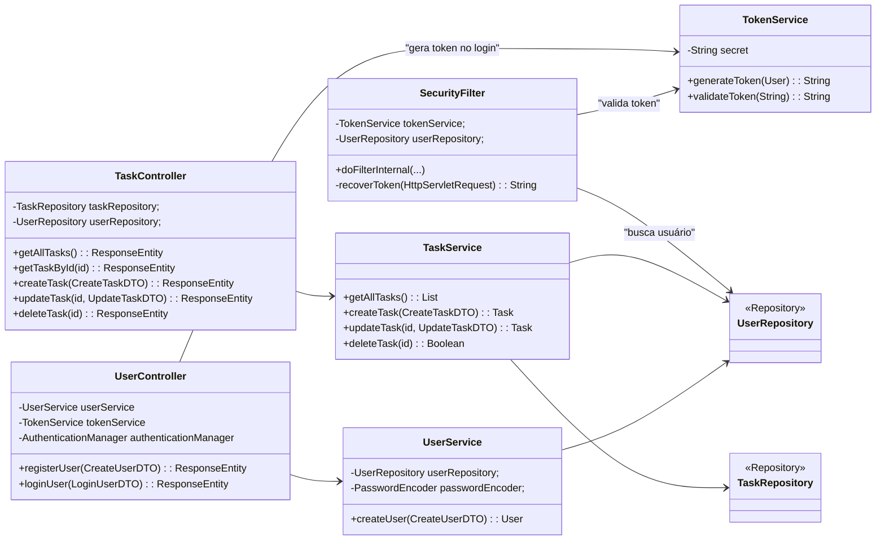

# To-Do List API

<br>

> API RESTful completa para gerenciamento de tarefas (To-Do List), desenvolvida com Java e Spring Boot. A aplicação é
> multiusuário, segura e utiliza autenticação baseada em tokens JWT (JSON Web Token).

## 📑 Sumário

- [Sobre o Projeto](https://www.google.com/search?q=%23sobre-o-projeto)
- [Funcionalidades](https://www.google.com/search?q=%23funcionalidades)
- [Arquitetura e UML](https://www.google.com/search?q=%23arquitetura-e-uml)
- [Tecnologias](https://www.google.com/search?q=%23tecnologias)
- [API Endpoints](https://www.google.com/search?q=%23api-endpoints)
- [Pré-requisitos](https://www.google.com/search?q=%23pr%C3%A9-requisitos)
- [Configuração do Ambiente](https://www.google.com/search?q=%23configura%C3%A7%C3%A3o-do-ambiente)
- [Executando com Docker (Recomendado)](https://www.google.com/search?q=%23executando-com-docker-recomendado)
- [Executando Localmente](https://www.google.com/search?q=%23executando-localmente)
- [Executando os Testes](https://www.google.com/search?q=%23executando-os-testes)
- [Roadmap do Projeto](https://www.google.com/search?q=%23roadmap-do-projeto)
- [Licença](https://www.google.com/search?q=%23licen%C3%A7a)

-----

## Sobre o Projeto

Este projeto é uma API RESTful robusta que fornece um backend completo para uma aplicação de lista de tarefas. O sistema
foi projetado para ser seguro e escalável, permitindo que múltiplos usuários se cadastrem, façam login e gerenciem suas
próprias listas de tarefas de forma isolada.

- **Status:** 🚀 **Aplicação Finalizada e Funcional**
- **Objetivo Principal:** Criar uma API segura, seguindo as melhores práticas de desenvolvimento com Spring Boot,
  incluindo autenticação, autorização e persistência de dados.

-----

## Funcionalidades

- ✅ **Autenticação de Usuários:** Sistema completo de registro e login com senhas criptografadas (BCrypt).
- 🔐 **Segurança com JWT:** Acesso aos endpoints protegido por JSON Web Tokens, garantindo que apenas usuários
  autenticados possam acessar seus dados.
- 🧍 **Isolamento de Dados:** Cada usuário tem acesso apenas às suas próprias tarefas. A API garante que um usuário não
  possa ver, alterar ou deletar as tarefas de outro.
- 📝 **CRUD Completo de Tarefas:** Operações de Criar, Ler, Atualizar e Deletar tarefas para cada usuário.
- 🐳 **Containerização:** Configuração completa com `Dockerfile` e `Docker-compose.yml` para facilitar a execução do
  ambiente (API + Banco de Dados) com um único comando.
- ⚙️ **Validação de Dados:** Validação de entrada nos DTOs para garantir a integridade dos dados recebidos pela API.

-----

## Arquitetura e UML

A arquitetura segue o padrão de camadas comum em aplicações Spring Boot, promovendo a separação de responsabilidades e
facilitando a manutenção.



**Fluxo de uma Requisição Segura:**

1. O cliente envia uma requisição para um endpoint protegido (ex: `/tasks`) com um token JWT no cabeçalho
   `Authorization`.
2. O `SecurityFilter` intercepta a requisição.
3. O `TokenService` valida o token.
4. O `SecurityFilter` busca os dados do usuário no `UserRepository` e o define no `SecurityContextHolder`.
5. A requisição chega ao `TaskController`, que agora tem acesso ao usuário autenticado.
6. O `TaskService` utiliza a identidade do usuário para executar a lógica de negócio (ex: buscar apenas as tarefas
   daquele usuário).

-----

## Tecnologias

- **Backend:**
    - [Java 25](https://www.oracle.com/java/)
    - [Spring Boot 3](https://spring.io/projects/spring-boot)
    - [Spring Security](https://spring.io/projects/spring-security) (para autenticação e autorização)
    - [Spring Data JPA](https://spring.io/projects/spring-data-jpa) (para persistência de dados)
- **Banco de Dados:**
    - [PostgreSQL](https://www.postgresql.org/)
- **Autenticação:**
    - [JSON Web Token (JWT)](https://jwt.io/)
    - [java-jwt (da Auth0)](https://github.com/auth0/java-jwt)
- **Build e Dependências:**
    - [Apache Maven](https://maven.apache.org/)
- **Containerização:**
    - [Docker](https://www.docker.com/)
    - [Docker Compose](https://docs.docker.com/compose/)

-----

## API Endpoints

| Método | Endpoint          | Protegido? | Descrição                                        |
|:-------|:------------------|:----------:|:-------------------------------------------------|
| `POST` | `/users/register` |     ❌      | Registra um novo usuário.                        |
| `POST` | `/users/login`    |     ❌      | Autentica um usuário e retorna um token JWT.     |
| `GET`  | `/tasks`          |     ✅      | Lista todas as tarefas do usuário autenticado.   |
| `GET`  | `/tasks/{id}`     |     ✅      | Busca uma tarefa específica do usuário pelo ID.  |
| `POST` | `/tasks`          |     ✅      | Cria uma nova tarefa para o usuário autenticado. |
| `PUT`  | `/tasks/{id}`     |     ✅      | Atualiza uma tarefa existente do usuá rio.       || `DELETE` | `/tasks/{id}` | ✅ | Deleta uma tarefa do usuário. |

-----

## Pré-requisitos

- [Java (JDK) 25](https://www.oracle.com/java/technologies/downloads/)
- [Docker](https://www.docker.com/get-started/) e [Docker Compose](https://docs.docker.com/compose/install/)
- [Maven](https://maven.apache.org/download.cgi) (opcional, pois o projeto usa o Maven Wrapper)
- [Git](https://git-scm.com/)

-----

## Configuração do Ambiente

O projeto utiliza um arquivo `.env` na raiz para configurar as variáveis de ambiente, incluindo as credenciais do banco
de dados e o segredo do JWT.

1. **Clone o repositório:**

   ```bash
   git clone https://github.com/WillianSilva51/todo-list-api.git
   cd todo-list-api
   ```

2. **Crie o arquivo `.env`:**
   Na raiz do projeto, crie um arquivo chamado `.env` e adicione o seguinte conteúdo.

   ```env
   POSTGRES_URL="jdbc:postgresql://localhost:5432/postgres"
   POSTGRES_USER=postgres
   POSTGRES_PASSWORD=postgres123
   POSTGRES_DB=postgres

   # Gere um segredo forte e aleatório para o token JWT
   # Exemplo de comando para gerar: openssl rand -base64 64
   TOKEN=seu-segredo-super-secreto-aqui
   ```

-----

## Executando com Docker (Recomendado)

A forma mais simples de rodar a aplicação e o banco de dados é com o Docker Compose.

**1. Inicie os contêineres:**
Na raiz do projeto, execute o comando:

```bash
docker compose up --build
```

Este comando irá construir a imagem da API, baixar a imagem do PostgreSQL e iniciar ambos os serviços. A API estará
disponível em `http://localhost:8080`.

**2. Para parar os contêineres:**
Pressione `CTRL + C` no terminal onde o compose está rodando, ou execute em outro terminal:

```bash
docker compose down
```

-----

## Executando Localmente

Se preferir rodar a aplicação diretamente na sua máquina (sem Docker), siga os passos:

1. **Inicie um banco de dados PostgreSQL:**
   Garanta que você tenha uma instância do PostgreSQL rodando em `localhost:5432` e que as credenciais correspondam às
   do seu arquivo `.env`.

2. **Execute a aplicação com o Maven Wrapper:**
   Na raiz do projeto, execute:

   ```bash
   ./mvnw spring-boot:run
   ```

   A API estará disponível em `http://localhost:8080`.

-----

## Executando os Testes

Para rodar os testes de integração e garantir que tudo está funcionando como esperado, use o comando:

```bash
./mvnw test
```

-----

## Roadmap do Projeto

- [x] Estrutura inicial do projeto com Spring Boot.
- [x] Definição das entidades `User` e `Task`.
- [x] Implementação do CRUD completo para tarefas.
- [x] Adição do Spring Security e configuração de segurança.
- [x] Implementação de registro de usuário com hashing de senha.
- [x] Implementação de autenticação via JWT (`login`).
- [x] Conexão das tarefas aos usuários e isolamento de dados.
- [x] Adição de verificação de posse para `update` e `delete`.
- [x] Containerização com Docker e Docker Compose.
- [x] Implementação do `GlobalExceptionHandler` para tratamento centralizado de erros.
- [ ] Escrita de testes unitários e de integração.
- [ ] Adicionar documentação da API com Swagger/OpenAPI.

-----

## Licença

Este projeto está licenciado sob a Licença MIT. Veja o arquivo [LICENSE](LICENSE) para mais detalhes.